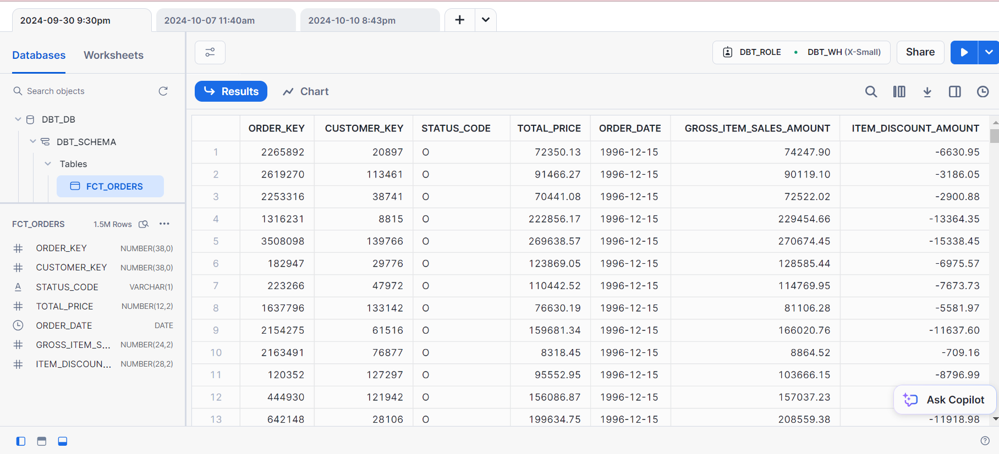

# Data Pipeline Project with DBT and Airflow

This project implements a data pipeline using **dbt** (Data Build Tool) for transforming data in **Snowflake** and **Airflow** for orchestration. The primary goal is to set up an efficient ELT process, transforming raw data into analytics-ready models within Snowflake, and managing the data workflow with Airflow DAGs.

## Project Structure

- **DBT Models**: Transformation of raw data to refined models using SQL.
- **Airflow DAGs**: Scheduling and orchestration of the data pipeline in Airflow.
- **Snowflake Integration**: Data storage and processing in Snowflake.

## Technologies Used

- **DBT**: For transforming and managing data models.
- **Snowflake**: Cloud-based data warehousing.
- **Airflow**: For scheduling and orchestrating the pipeline.
- **Docker**: Containerization for running services.
- **Astro**: Deployment and monitoring platform for Airflow.

## Screenshots

### DBT Data in Snowflake

This screenshot shows the results of a data transformation using DBT in Snowflake:

### Airflow DAG for DBT

Here is the Airflow DAG managing the pipeline execution:

## Setup Instructions

1. Clone the repository.
2. Build the Docker containers.
3. Configure dbt for Snowflake and set up the Airflow DAGs.
4. Run the pipeline by triggering the Airflow DAG.

## Conclusion

This project sets up a scalable data pipeline, leveraging dbt for data transformation and Airflow for orchestration, with data stored in Snowflake. This structure can be adapted for larger datasets and more complex workflows.
